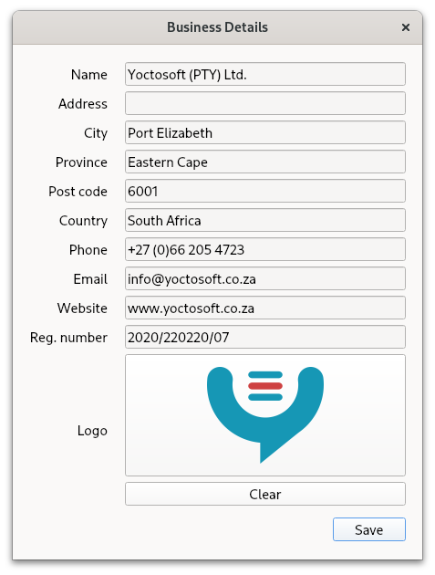
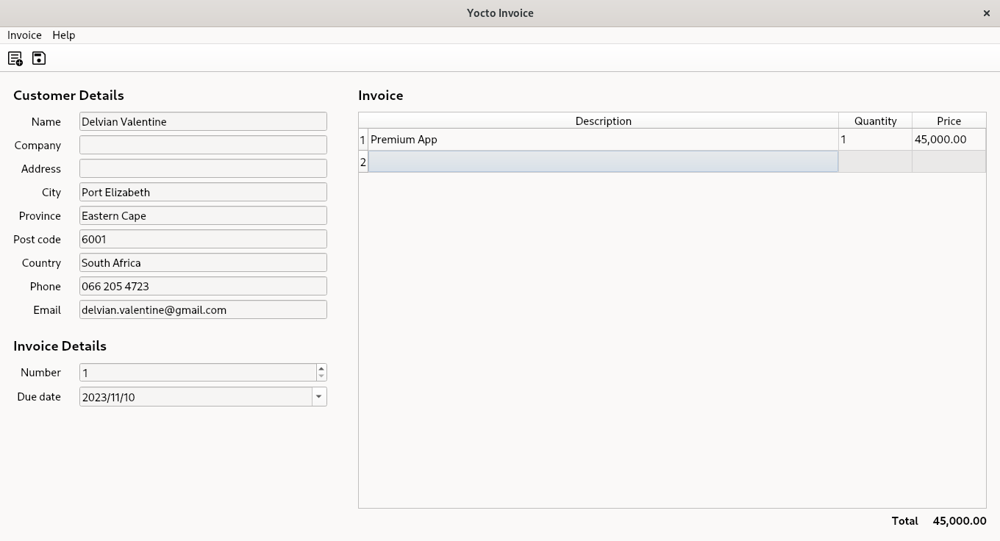

# Yocto Invoice

Create beautiful invoices quickly and effortlessly

## Usage

You'll be prompted to fill in your business details the first time you run the app. If you need to change your business details later, you can do it in the Invoice menu.

Fill in your customer and invoice details in the main window.

Click Save in the Invoice menu to save the invoice as a PDF. You can also save a quote if you click Save Quote in the Invoice menu.

## Support

Email delvian.valentine@gmail.com for help

## Acknowledgements

- [Material Icons](https://fonts.google.com/icons)
- [PyInstaller](https://pyinstaller.org/en/stable/)
- [Qt for Python](https://wiki.qt.io/Qt_for_Python)
- [ReportLab](https://www.reportlab.com/)
- [UXWing](https://uxwing.com/)

## Licence

Copyright © 2024 [Delvian Valentine](mailto:delvian.valentine@gmail.com)
